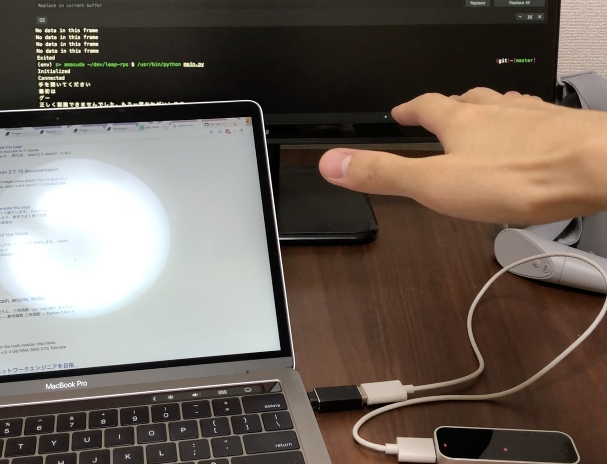

# leap-rps

Rock Paper Scissors in Leap Motion.

It use heuristic algorithm to predict what RPS the oponent will perform.

## dev

```
git clone git@github.com:Go-zen-chu/leap-rps.git
pip install -r requirement.txt
```

For text2speech, we currently use macOS's say command.

## demo

The demo shows how this application works.

RPS in Japanese starts with rock (saisho ha gu) and then it predict what I tried to perform.



[leap_rps_predict](https://drive.google.com/file/d/1E1eh0LA_mm1pT90nY5LKceBVMDj04x0T/view?usp=sharing)

## how it works

```
# this will connect to leap and start RPS classification and create rps.txt which classified result is written
$ python main.py

# run websocket server independently and read 
$ python rps_ws_server.py
```
